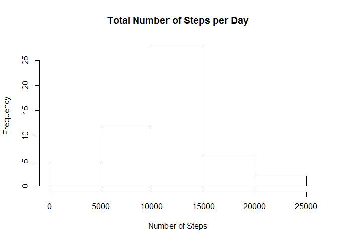
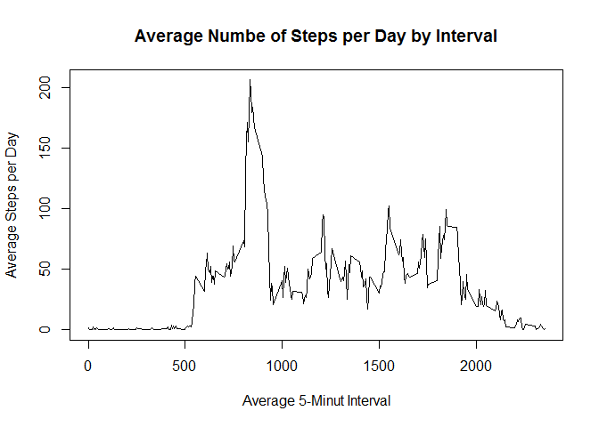
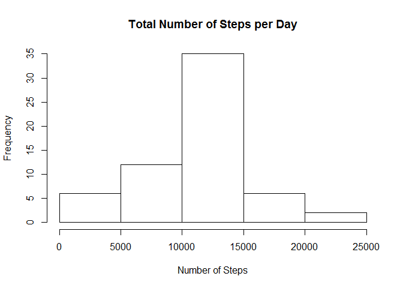
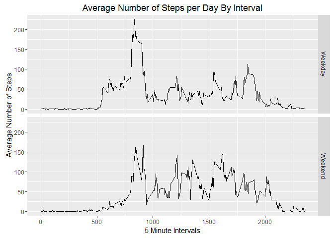

# Reproducible Research: Peer Assessment 1


## Assignment: Course Project 1

Introduction:
It is now possible to collect a large amount of data about personal movement using activity monitoring devices such as a [Fitbit](http://www.fitbit.com/), [Nike Fuelband](http://www.nike.com/us/en_us/c/nikeplus-fuelband), or [Jawbone Up](https://jawbone.com/up).
These type of devices are part of the "quantified self" movement - a group of enthusiasts who take measurements about themselves
regularly to improve their health, to find patterns in their behavior, or because they are tech geeks. But these data remain under-utilized
both because the raw data are hard to obtain and there is a lack of statistical methods and software for processing and interpreting the data.
This assignment makes use of data from a personal activity monitoring device. This device collects data at 5 minute intervals through out the
day. The data consists of two months of data from an anonymous individual collected during the months of October and November, 2012
and include the number of steps taken in 5 minute intervals each day.
The data for this assignment can be downloaded from the course web site:
. Dataset: [Activity monitoring data](https://d396qusza40orc.cloudfront.net/repdata%2Fdata%2Factivity.zip)  
The variables included in this dataset are:  
- **steps**: Number of steps taking in a 5-minute interval (missing values are coded as  
- **date**: The date on which the measurement was taken in YYYY-MM-DD format  
- **interval**: Identifier for the 5-minute interval in which measurement was taken  
The dataset is stored in a comma-separated-value (CSV) file and there are a total of 17,568 observations in this dataset.

**Loading and preprocessing the data**  
Show any code that is needed to  
1. Loads and procceessed the data (i.e. read.csv)  

```r
if(!file.exists("./data")){dir.create("./data")}
fileURL <- "http://d396qusza40orc.cloudfront.net/repdata%2Fdata%2Factivity.zip"
download.file(fileURL, dest="Factivity.zip", mode="wb")
unzip("Factivity.zip")
activity <- read.csv("activity.csv")
```
  
**What is mean total number of steps taken per day?**  
For this part of the assignment, you can ignore the missing values in the dataset.  
1.	The total number of steps taken per day  

```r
sumstepsperday <- aggregate(steps~date, activity, sum)
```
  
2.	A histogram of the total number of steps taken each day

```r
#png(file="histsumstepsperday.png")
hist(sumstepsperday$steps, xlab = "Number of Steps", main="Total Number of Steps per Day")
```



```r
#dev.off()
```
  
3a.	The mean of the total number of steps taken per day  

```r
meanstepsperday <- aggregate(steps~date, activity, mean)
meansteps <- mean(sumstepsperday$steps)
print(meansteps)
```

```
## [1] 10766.19
```
1.0766189\times 10^{4}
  
3b.  The median of the total number of steps taken per day  

```r
medianstepsperday <- aggregate(steps~date, activity, median)
mediansteps <- median(sumstepsperday$steps)
print(mediansteps)
```

```
## [1] 10765
```
10765
  
**What is the average daily activity pattern?**
1.	A time series plot (i.e. type="l" ) of the 5-minute interval (x-axis) and the average number of steps taken, averaged across all days (y-axis)   

```r
meanintervalperday <- aggregate(steps~interval, activity, mean)
#png(file="meanintervalperday.png")
plot(meanintervalperday$interval, meanintervalperday$steps, type = "l", xlab = "Average 5-Minut Interval", ylab = "Average Steps per Day", main="Average Numbe of Steps per Day by Interval")
```



```r
#dev.off()
```
  
2.	The 5-minute interval, averaged across all the days, with the maximum number of steps is

```r
max_interval <- meanintervalperday[which.max(meanintervalperday$steps),1]
print(max_interval)
```

```
## [1] 835
```
835
   
**Imputing missing values**
There are a number of days/intervals where there are missing values (coded as NA). The presence of missing days introduces bias into some calculations or summaries of the data.  

1.	The total number of missing values (i.e. the total number of rows with NAs):  

```r
nasteps <- sum(is.na(activity$steps))
nadate <- sum(is.na(activity$date))
nainterval <- sum(is.na(activity$interval))
```
missing steps:  2304  
missing dates:  0  
missing intervals:  0  
  
2.	A new dataset that is equal to the original dataset but with the missing data filled in with the average intervals per day.  

```r
activitynonas <- transform(activity, steps = ifelse(is.na(activity$steps), meanintervalperday$steps[match(activity$interval, meanintervalperday$interval)], activity$steps))
```
  
3a.	A histogram of the total number of steps taken each day

```r
activitynonas[as.character(activitynonas$date) == "2012-10-01", 1] <- 0
sumstepsperdaynonas <- aggregate(steps~date, activitynonas, sum)
#png(file="sumstepsperdaynonas.png")
hist(sumstepsperdaynonas$steps, xlab = "Number of Steps", main="Total Number of Steps per Day")
```



```r
#dev.off()
```
  
  3b. The mean total number of steps taken per day is:  

```r
meanstepsnonas <- mean(sumstepsperdaynonas$steps)
print(meanstepsnonas)
```

```
## [1] 10589.69
```
1.0589694\times 10^{4}

The difference between the mean with missing values and the mean without missing values is:

```r
meansteps <- mean(sumstepsperday$steps)
meandiffnas <- meansteps - meanstepsnonas
print(meandiffnas)
```

```
## [1] 176.4949
```
176.4948964

3c. The median total number of steps taken per day is:  

```r
medianstepsnonas <- median(sumstepsperdaynonas$steps)
medianstepsnonas
```

```
## [1] 10766.19
```
1.0766189\times 10^{4}

The difference between the median with missing values and the median without missing values is:

```r
mediandiffnas <- medianstepsnonas - mediansteps
print(mediandiffnas)
```

```
## [1] 1.188679
```
1.1886792
  
3d.  The impact of imputing missing data on the estimates of the total daily number of steps is:

```r
stepsdiffna = sum(sumstepsperdaynonas$steps) - sum(sumstepsperday$steps)
print(stepsdiffna)
```

```
## [1] 75363.32
```
7.5363321\times 10^{4}

**Are there differences in activity patterns between weekdays and weekends?**  
1.	A new factor variable in the dataset with two levels - "weekday" and "weekend" indicating whether a given date is a weekday or weekend day.  

```r
workdays <- c("Monday", "Tuesday", "Wednesday", "Thursday", "Friday")
activitynonas$date <- as.Date(activitynonas$date)
activitynonas$dow <- weekdays(activitynonas$date)
activitynonas$typedow = as.factor(ifelse(is.element(activitynonas$do,workdays),"Weekday","Weekend"))
```
  
2.	A panel plot containing a time series plot (i.e. type="l") of the 5-minute interval (x-axis) and the average number of steps taken, averaged across all weekday days or weekend days (y-axis).  

```r
meanstepspertypedow <- aggregate(steps ~ interval + typedow, activitynonas, mean)
library(ggplot2)
#png(file="stepspertypedow.png")
stepspertypedow_plot <- ggplot(data = meanstepspertypedow, aes(x=interval, y=steps))
stepspertypedow_plot + geom_line()+facet_grid(typedow~.)+xlab("5 Minute Intervals")+ylab("Average Number of Steps")+ggtitle("Average Number of Steps per Day By Interval")
```



```r
#dev.off()
```
